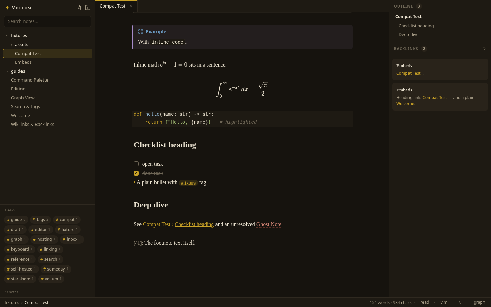
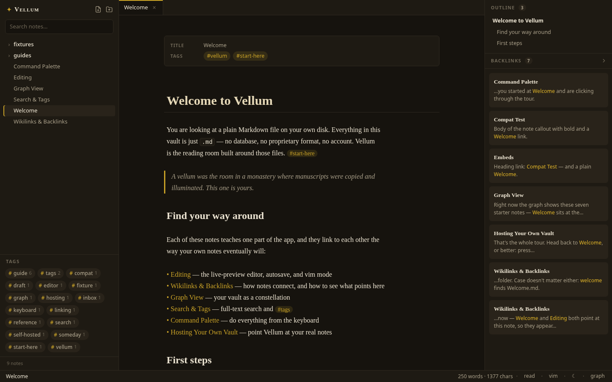
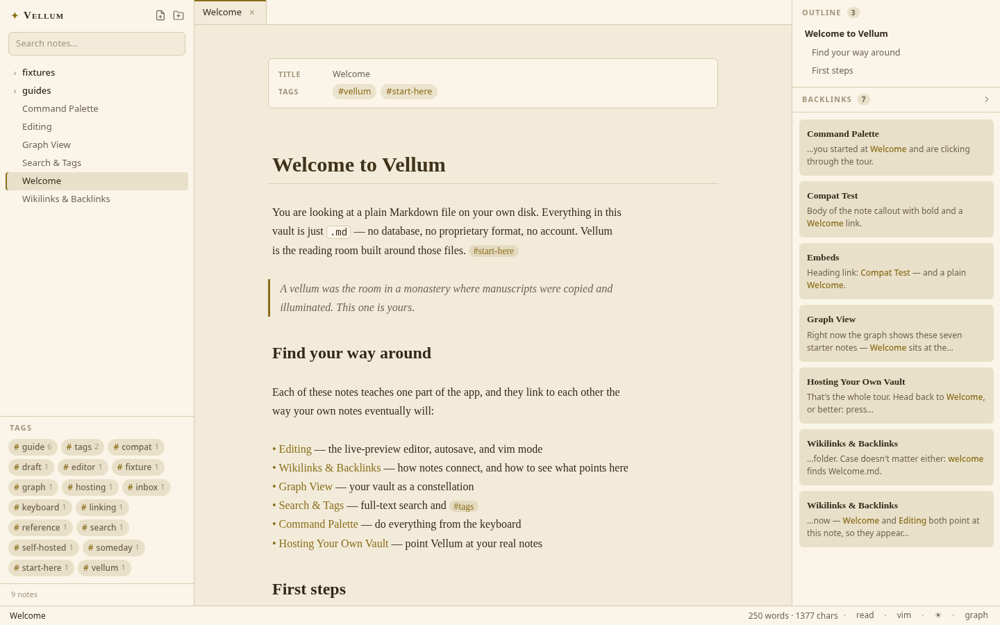
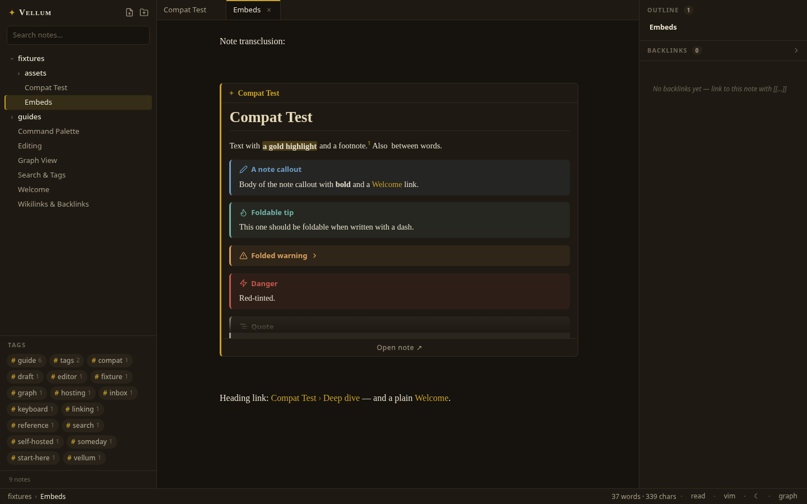
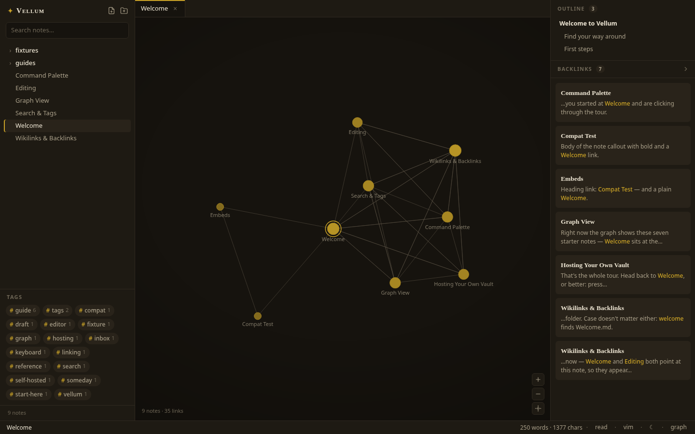

# Vellum

**A self-hosted Obsidian-style vault and publish site for a folder of plain Markdown — live-preview editor, wikilinks, backlinks, graph view, embeds, callouts, math, a full reading view, and full-text search, all served by one small Node process.**

> A *vellum* was the candlelit room where manuscripts were copied and illuminated. This one runs on `localhost`.



## Why not just Obsidian?

Obsidian is excellent — and if it fits, use it. Vellum exists for the gap it leaves: a vault you can open **from any browser** on your network, served by **one small Node process you host yourself**, with no desktop install, no sync subscription, and no plugin sprawl. It is local-first in the strictest sense: your notes are ordinary markdown files in an ordinary folder, readable and writable by every other tool you own. Point Vellum at an existing Obsidian vault and both keep working — Vellum never converts, wraps, or databases your files, ignores `.obsidian/` entirely, and serves your existing attachments in place. If you delete the app tomorrow, your notes don't notice.

## Quickstart

```sh
git clone https://github.com/ZahakJ/vellum.git
cd vellum
npm install
npm start
```

Open **http://localhost:6801**. On first launch Vellum creates `./vault` and seeds it with eight interlinked starter notes that double as the user manual.

### Point it at your own notes

Any folder of `.md` files is a vault — including a real Obsidian vault:

```sh
VELLUM_VAULT=~/notes npm start
# or
npm start -- --vault ~/notes
```

What carries over from Obsidian: `[[wikilinks]]` (aliases, `#heading` links, rename-safe),
`![[embeds]]` (images, PDFs, note transclusions), callouts, `$…$`/`$$…$$` math, `#tags` and
frontmatter `tags:`, frontmatter properties, highlights, comments, footnotes, daily notes.
The `.obsidian/` config directory is ignored everywhere (tree, index, graph, watcher), nothing
is ever converted or moved, and attachments are served in place — the same vault keeps working
in Obsidian.

### Share it: public reading, admin editing

Out of the box Vellum runs in **open local mode** — no password, every visitor is an admin (a warning is printed at startup). To put a vault on a network you don't fully trust, set an admin password:

```sh
cp .env.example .env
npm run hash-password        # prompts for a password, prints an argon2id hash
```

Put the printed hash in `.env` (single-quoted — it contains `$`), plus a cookie-signing secret:

```sh
ADMIN_PASSWORD_HASH='$argon2id$v=19$m=65536,...'
SESSION_SECRET=some-long-random-string   # e.g. openssl rand -hex 32
```

With a hash set, visitors get the **reading view**: fully rendered notes, search, graph, backlinks — but no editor and no create/rename/delete anywhere. A quiet "Sign in" link in the status bar opens the login modal; a correct password sets a signed, httpOnly 30-day session cookie and unlocks editing on the spot, no reload. Login attempts are rate-limited (10/min/IP). Set `PUBLIC=false` to require login even for reading, and `HOME_NOTE` to pick the note fresh visitors land on.

As the signed-in admin you can **preview as visitor** at any time — the eye icon in the status bar, or "Preview as visitor" in the command palette. It is not a client-side imitation: every request is re-scoped server-side through the exact code path a stranger's request takes (published-only tree, search, graph, feed of events), so what you see is byte-for-byte what the public site serves. A slim gold banner marks the mode; "Exit preview" returns you to the full app on the same note.

To put it on the internet, run Vellum behind any HTTPS reverse proxy (Caddy, nginx, a Cloudflare tunnel, …) forwarding to `localhost:6801` — the app is a single origin (API + static client on one port), so no special proxy rules are needed; just make sure it is only reachable over TLS so the login password and session cookie stay private. When you do sit it behind a proxy, also set `TRUSTED_PROXIES` to the proxy's address (e.g. `TRUSTED_PROXIES=127.0.0.1,::1`) so the login rate limit keys off the real client IP from `X-Forwarded-For` instead of lumping everyone together as the proxy's IP. The header is only ever trusted when the connection comes from a listed address — otherwise it is ignored, since clients can forge it.

Request bodies are capped server-side before any parsing buffers them: 10 MB on any `/api` request, and a much tighter 64 KB on the anonymous surfaces (comment posts and login), so oversized uploads are rejected (HTTP 413) instead of occupying memory. A matching cap at the proxy is still a sensible extra layer — e.g. nginx `client_max_body_size 10m;`.

All `.env` keys (npm scripts load the file automatically via `node --env-file-if-exists=.env`; see `.env.example` for the full annotated list):

| Key | What |
| --- | ---- |
| `PORT` | Server port (default 6801) |
| `VELLUM_VAULT` | Vault directory (default `./vault`) |
| `ADMIN_PASSWORD_HASH` | argon2id hash from `npm run hash-password`; unset → open local mode |
| `SESSION_SECRET` | Signs session cookies; unset → ephemeral, sessions die on restart |
| `PUBLIC` | `false` requires login even to read (default: reading is public) |
| `TRUSTED_PROXIES` | Comma-separated IPs/CIDRs allowed to set `X-Forwarded-For` (e.g. `127.0.0.1,::1`); unset → header ignored, rate limit uses the socket address |
| `HOME_NOTE` | Vault-relative note fresh visitors land on, e.g. `index.md` |
| `COMMENTS` | `on` enables reader comments under published notes (default off) |
| `VELLUM_DATA` | Server data directory — the comments SQLite db, your `custom.css`, and `fonts/` (default `./data`) |
| `SITE_NAME` | Site name shown in the sidebar wordmark, page titles, and the login modal (default `Vellum`) |
| `DEFAULT_THEME` | Theme for visitors who haven't picked one: `iron-gall`, `void`, `lapis`, or `parchment` |
| `EXCLUDE_TAGS` | Comma-separated tags hidden from the visitor site's topic sections and tag pills (workflow/status tags like `baby,child,adult`); admin views unaffected |
| `PUBLIC_LAYOUT` | `blog` gives visitors a classic blog layout instead of the app shell (see [Blog mode](#blog-mode)); default `app` |
| `SITE_TAGLINE` | Masthead subtitle under the site name (blog mode) |
| `SITE_FOOTER` | Blog footer line; `{year}`/`{siteName}` substituted (default `© {year} {SITE_NAME}`) |
| `BLOG_LOCALE` | BCP47 locale for post dates and the RSS channel language (default `en`) |
| `SITE_URL` | Canonical origin for RSS/canonical links, e.g. `https://notes.example.com`; unset → derived from request headers |

### Comments

Set `COMMENTS=on` and every **published** note grows a quiet "Marginalia" section under its
reading view: visitors can leave a plain-text note (name optional — "Anonymous" otherwise),
and admins see a delete `×` on each comment for moderation. Off (the default), the feature is
completely dark — no UI, and the API routes answer 404.

Comments are stored in an SQLite file at `VELLUM_DATA/comments.db` (default `./data/`, created
on demand, gitignored) using Node's built-in `node:sqlite` — no extra dependencies. Abuse
controls are built in: post requests over 64 KB are rejected before any parsing touches
them, posting is rate-limited to 5 comments/min/IP (honoring
`TRUSTED_PROXIES` for the real client address, same as login), bodies are capped at 2000
characters of plain text (always rendered escaped, never as HTML/markdown), names at 40, and
the form carries a hidden honeypot field that silently swallows bot submissions. Comments can
only ever be read or written on notes with `publish: true` — for anything else the API answers
the same 404 a missing note would, so unpublished paths stay unguessable. With `PUBLIC=false`
(fully private vault), visitors can neither read nor post comments at all.

### Blog mode

`PUBLIC_LAYOUT=blog` re-dresses the visitor-facing site as a classic blog: a masthead with the
site name and `SITE_TAGLINE`, a horizontal nav of topic categories, article pages with title,
date, word count, reading time and tags, comments below (with `COMMENTS=on`), and a footer
(`SITE_FOOTER`, default `© <year> <SITE_NAME>`; `{year}` and `{siteName}` placeholders are
substituted). Arabic and other RTL content renders per-article in its natural direction.
Signed-in admins are unaffected — the full app, sidebar and all, stays exactly as it is; the
blog shell exists only for visitors. Post dates are formatted in `BLOG_LOCALE` (any BCP47 tag,
default `en`).

The home page opens with `HOME_NOTE` rendered as an intro section (when that note is
published) above the reverse-chronological post list. Topic pages live at `/topic/<tag>`;
article deep links keep their normal note URLs. Each article ends with share links, prev/next
posts, a "Related" list (published notes wikilinked from/to it), and comments. The footer
carries a quiet RSS link, a sign-in link, and a tiny "powered by Vellum" credit — hide it with
`.s-blog-powered { display: none }` in your [`custom.css`](#theming) if you prefer.

What counts as a post: every note with `publish: true`, newest first. A post's date comes from
a frontmatter `date:` (or `created:`) field when it parses; otherwise the file's creation/
modification time — so if you migrated a vault by copying files (which resets file times), add
`date:` frontmatter to your posts or they will all sort as "created the day of the copy". The
excerpt is the first real paragraph of prose (markdown stripped, template furniture like bare
timestamps and `Tags: #a #b` lines skipped), cut at ~220 characters on a word boundary.
`GET /api/posts` serves the list.

> **Set `EXCLUDE_TAGS` before you go live.** The topic nav is built from the tags of published
> notes — including workflow tags (status markers like `#draft`/`#seedling`, zettel maturity,
> todo states), which would otherwise surface as public categories. List them in
> `EXCLUDE_TAGS` and they disappear from the nav, topic pages, and article tag chips; your
> vault and the admin view are unaffected.

Two crawler-facing surfaces come along regardless of layout (both respect `PUBLIC=false` and
speak only in published notes — unpublished paths are indistinguishable from unknown ones):

- **RSS** at `/feed.xml` — RSS 2.0, advertised on every page via
  `<link rel="alternate" type="application/rss+xml">`, items linking to each note's deep-link
  URL with the excerpt as description.
- **SEO meta** — the served HTML shell carries server-injected `<title>`, `meta description`,
  Open Graph (`og:type=article` on note pages) and canonical tags; note deep links get the
  note's own title and excerpt, everything else the generic site meta.

Absolute URLs in both are built from `SITE_URL` when set, else derived from the request's
`Host`/`X-Forwarded-*` headers.

### Theming

If Vellum is replacing a blog, you probably want it to stop saying "Vellum" and start looking
like *your* site. Three env-driven hooks cover that, no fork required:

**Name it.** `SITE_NAME=Night Garden` rebrands every visible surface — the `✦` wordmark in the
sidebar, the browser tab titles (`Note · Night Garden`), and the sign-in modal.

**Pick the default look.** Vellum ships four themes: `iron-gall` (warm near-black, the default),
`void` (neutral cool black with a starlight-steel accent — the one theme without gold), `lapis`
(deep blue-black), and `parchment` (warm paper light).
Every reader can switch themes from the status bar or command palette and their choice sticks
in their browser; `DEFAULT_THEME=parchment` sets what first-time visitors see before they choose.

**Restyle it.** Drop a `custom.css` into your data directory (`VELLUM_DATA`, default `./data/`)
and Vellum serves it at `/api/custom.css` and loads it after its own stylesheets — for every
visitor and for you, in dev and prod, no rebuild, no restart. Because it loads last, your rules
win. The whole UI is driven by CSS custom properties on `:root` (and per-theme overrides via
`html[data-theme="…"]`), so most re-skins are a handful of token lines:

```css
/* data/custom.css — a green-accented reading room */
:root,
html[data-theme="lapis"] {
  --accent: #5da06b;
  --accent-soft: rgba(93, 160, 107, 0.14);
  --font-serif: "Iowan Old Style", Georgia, serif;
}
```

The token API (define them on `:root` for all themes, or under `html[data-theme="void"]` etc.
for one):

| Token | Drives |
| ----- | ------ |
| `--bg` / `--bg-raised` / `--bg-hover` | Page background / sidebar & panels / hover rows |
| `--text` / `--text-muted` / `--text-faint` | Body text / secondary text / hints & counts |
| `--accent` / `--accent-soft` | Gold-leaf brand color (links, wikilinks, active marks) / its translucent wash |
| `--border` | The 1px hairlines everywhere |
| `--danger` | Destructive actions, broken-link tint |
| `--font-ui` / `--font-serif` / `--font-mono` | UI chrome / prose & headings / code |
| `--radius` | Corner rounding (default 6px) |
| `--sidebar-w` | Sidebar width (default 280px) |
| `--callout-note`, `--callout-tip`, … | Per-type callout hues (see `client/styles/tokens.css`) |
| `--syn-keyword`, `--syn-string`, … | Code-highlighting palette |

**Bring your own fonts.** Vellum ships zero webfonts by design, but your instance doesn't have
to. Drop font files into `VELLUM_DATA/fonts/` (default `./data/fonts/`) and they are served at
`/api/fonts/<file>` — `woff2`, `woff`, `ttf`, and `otf` only, strictly by basename, with ETags
and immutable year-long cache headers. Wire them up with an `@font-face` in `custom.css`:

```css
/* data/custom.css — serve data/fonts/MyFont.woff2 as the prose face */
@font-face {
  font-family: "MyFont";
  src: url("/api/fonts/MyFont.woff2") format("woff2");
  font-display: swap;
}
:root {
  --font-serif: "MyFont", Georgia, serif;
}
```

Anything beyond tokens is fair game too — every element carries a stable `s-` prefixed class
(`.s-sidebar`, `.s-rv-p`, `.s-statusbar`, …), so `custom.css` can restyle specific components.
If you keep body text ≥ 4.5:1 contrast against `--bg`, the whole app stays readable.

### Dev mode

```sh
npm run dev
```

Runs the API server and Vite with hot reload side by side.

| Port | What | When |
| ---- | ---- | ---- |
| 6801 | Hono server (API + built client) | `npm start` / always |
| 5801 | Vite dev server (proxies `/api` → 6801) | `npm run dev` only |

`PORT` overrides the server port. `npm run typecheck` keeps the strict TypeScript build honest.
`scripts/shoot.mjs` is the screenshot harness used for visual review: point it at a running
server (`node scripts/shoot.mjs http://localhost:6801 shots`) and it captures the editor, graph,
and palette in both themes — it needs `npm i -D playwright` plus either
`npx playwright install chromium` or a system browser via `CHROMIUM=/usr/bin/chromium`.
`node scripts/check-contrast.mjs` is the accessibility gate for `client/styles/tokens.css`:
every theme must keep body text ≥ 4.5:1 and secondary text ≥ 3:1 — run it after touching
theme tokens.

## Features

### Writing

- **Live-preview editor** (CodeMirror 6) — markdown syntax hides itself except on the line you're editing; headings set in serif, clickable checkboxes, gold `[[wikilinks]]`, tag pills
- **Wikilinks with autocomplete** — type `[[` and pick any note; `[[Name|alias]]` and `[[Name#heading]]` supported (type `#` inside the brackets to complete headings); heading links render as `Note › Heading` and jump straight to the heading; renames rewrite every link that pointed at the old name
- **Click to follow, click to create** — plain click follows a rendered link; clicking an unresolved (dashed) link creates the note, Obsidian-style
- **Frontmatter properties card** — YAML frontmatter collapses to a neat key/value card with clickable tag pills while your cursor is outside it
- **Vim mode**, autosave (600 ms debounce + `Ctrl/Cmd S`), and a keyboard-first surface

### Rendering

- **Image embeds** — `![[image.png]]`, `![[image.png|300]]`, and standard `` render inline from your vault's attachments; broken embeds get a dashed placeholder
- **Note transclusions** — `![[Note]]` renders the target note as a full-fidelity card (callouts, math, code highlighting included), with an "Open note" affordance when the excerpt overflows
- **PDF & attachment cards** — `![[file.pdf]]` (mp4, mp3, zip, …) becomes a card that opens the file in a new tab
- **Callouts** — `> [!note]`, `[!tip]`, `[!warning]`, `[!danger]` and friends, tinted and iconed, foldable with `-`
- **Math** — `$inline$` and `$$block$$` via KaTeX
- **Code highlighting** — fenced blocks highlight for all common languages, themed to match
- **Highlights, comments, footnotes** — `==mark==`, `%%hidden comment%%`, `[^1]` superscript refs that jump to their definitions
- **Reading view** — `Ctrl/Cmd E` flips the note to a fully rendered, read-only page (tables included), sharing the editor's resolve logic

### Navigating

- **Backlinks panel** — every note shows who links to it, with the sentence that did
- **Outline (TOC) panel** — the open note's headings, tracking your scroll position; click to jump
- **Graph view** — hand-rolled canvas force simulation; drag nodes, hover to highlight neighbors, click to open
- **Full-text search** — prefix + fuzzy (MiniSearch), highlighted snippets with markdown syntax stripped, instant
- **Tags** — `#inline` and frontmatter `tags:`, counted and clickable in the sidebar
- **Daily notes** — `Ctrl/Cmd D` opens (or creates) `daily/YYYY-MM-DD.md`
- **Command palette** — fuzzy over notes and commands, including "Toggle reading view", "Open daily note", themes, vim
- **Live vault watching** — edit a file in any other editor and the app updates within ~100 ms (chokidar + SSE)
- **Four hand-tuned themes** — *iron-gall*, *void*, and *lapis* dark, *parchment* light; gold-leaf accent, zero external fonts or CDN requests

## Keymap

| Keys | Action |
| ---- | ------ |
| `Ctrl/Cmd P` | Command palette (open note, run command) |
| `Ctrl/Cmd E` | Toggle reading view ⇄ editor |
| `Ctrl/Cmd D` | Open today's daily note |
| `Ctrl/Cmd N` | New note |
| `Ctrl/Cmd G` | Toggle graph view |
| `Ctrl/Cmd S` | Save now (autosave runs regardless) |
| Click | Follow a rendered wikilink (create it if unresolved) |
| `Ctrl/Cmd`-click | Follow a wikilink on the line you're editing |
| `↑` `↓` `Enter` `Esc` | Navigate / confirm / dismiss the palette |

In vim mode, `Ctrl D` inside the editor keeps its half-page scroll; use the palette's "Open daily note".

## Screenshots

| | |
| --- | --- |
|  |  |
|  |  |

## Architecture

```
┌────────────────────────────┐        ┌─────────────────────────────┐
│  Client — React + CM6      │  HTTP  │  Server — Hono (Node ≥22.6) │
│  live preview · reading    │◄──────►│  /api: tree · note · file   │
│  view · graph · palette    │  SSE   │  search · graph · backlinks │
│  outline · zustand store   │        │  tags · resolve             │
└────────────────────────────┘        │  in-memory index (MiniSearch│
                                      │  + link graph) ← chokidar   │
                                      └──────────────┬──────────────┘
                                                     ▼
                                     your vault: .md files + attachments
```

- **Server** (`server/`) — Hono on Node's native TypeScript support (no build step for the backend). Watches the vault with chokidar (ignoring `.obsidian`, `.git`, dotfiles), keeps an in-memory MiniSearch index plus a wikilink graph, streams change events over SSE, and serves attachments (`/api/file`) with ETags. Nothing is ever written outside the vault.
- **Client** (`client/`) — React + zustand, CodeMirror 6 editor with a custom live-preview decoration plugin, a standalone reading-view renderer that shares the editor's link/embed resolve logic, canvas graph view. Built by Vite into `dist/`, statically served in production.
- **Shared** (`shared/types.ts`) — the wire contract both sides import.

## License

[MIT](LICENSE) © 2026 avicenna
